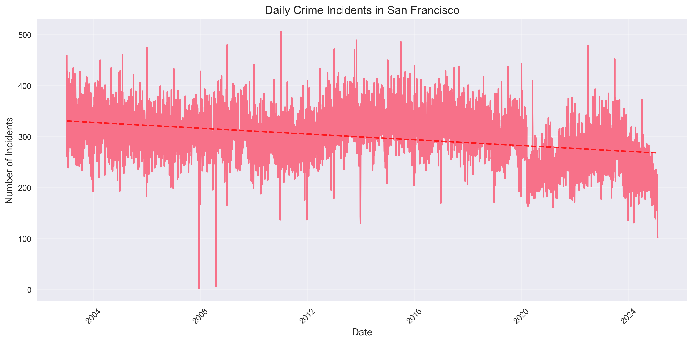

# Understanding Crime Patterns in San Francisco: A Data-Driven Story

## Introduction
This analysis explores patterns in San Francisco crime data, providing insights into how different types of crimes are distributed across the city and how they've changed over time. The data comes from the San Francisco Police Department's incident reports, which provide a comprehensive view of reported crimes in the city.

## The Data
The dataset includes reported incidents from 2003 to 2015, containing information such as:
- Date and time of the incident
- Location (latitude and longitude)
- Category of crime
- Description
- Resolution status

## Key Findings

### 1. Temporal Patterns in Crime
The time series analysis reveals interesting patterns in crime rates over the years. As shown in the figure below, we can observe both daily and seasonal variations in crime incidents. The red dashed line represents the overall trend in crime rates.

Key observations from the time series:
- There are clear daily patterns in crime rates
- Seasonal variations are visible throughout the years
- The trend line helps identify overall changes in crime rates

### 2. Geographic Distribution
The interactive map below shows the spatial distribution of crimes across San Francisco. This visualization helps identify areas with higher crime rates and potential hotspots.

<iframe src="assets/images/crime_map.html" width="100%" height="500px" frameborder="0"></iframe>

Key observations from the map:
- Crime density varies significantly across neighborhoods
- Some areas show clear clustering of incidents
- The map allows for interactive exploration of specific locations

### 3. Interactive Crime Analysis
The interactive visualization below allows you to explore the distribution of different crime categories. Hover over the bars to see detailed information about each category.

<iframe src="assets/images/interactive_viz.html" width="100%" height="500px" frameborder="0"></iframe>

Key observations from the category analysis:
- Some crime categories are significantly more prevalent than others
- The distribution provides insights into the most common types of incidents
- Interactive features allow for detailed exploration of specific categories

## Key Insights
1. **Temporal Patterns**: The data shows clear patterns in crime rates, with certain times of day and seasons showing higher incident rates. The trend line helps identify overall changes in crime patterns over time.

2. **Geographic Distribution**: Crime is not evenly distributed across the city, with certain neighborhoods showing higher concentrations of incidents. This information can be valuable for resource allocation and community safety initiatives.

3. **Category Analysis**: Some crime categories are more prevalent than others, and understanding these patterns can help in resource allocation and prevention strategies.

## Methodology
This analysis was conducted using Python, with the following key libraries:
- Pandas for data manipulation and analysis
- Matplotlib and Seaborn for static visualizations
- Folium for interactive map creation
- Bokeh for interactive data exploration

The visualizations were created with a focus on:
- Clear and intuitive presentation
- Interactive elements for exploration
- Consistent styling and formatting
- Informative labels and legends

## References
1. San Francisco Police Department Crime Data
2. [San Francisco Open Data Portal](https://data.sfgov.org/)
3. [SFPD Annual Reports](https://www.sanfranciscopolice.org/your-sfpd/reports-data)
4. [San Francisco Crime Statistics](https://www.sanfranciscopolice.org/your-sfpd/crime-statistics) 